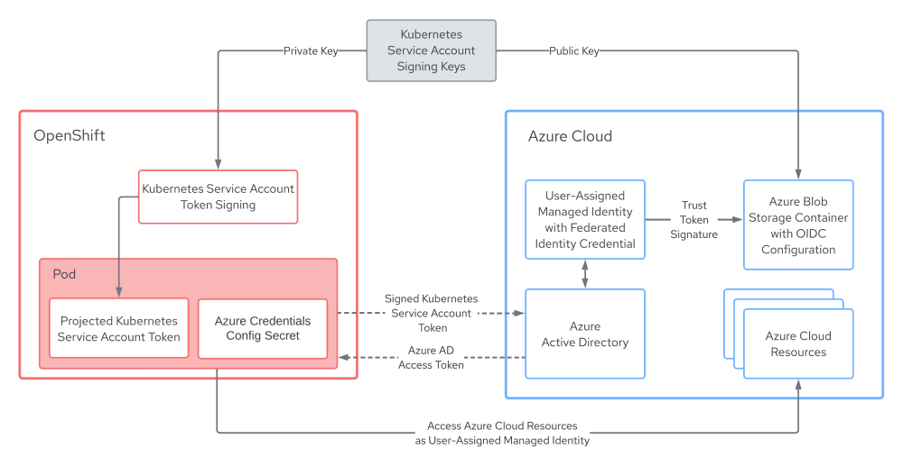

# Azure AD Workload Identity

### Overview
OpenShift can be configured to use temporary credentials for workload components with [Azure AD Workload Identity](https://azure.github.io/azure-workload-identity/docs/). In this model, the OpenShift cluster signs Kubernetes ServiceAccount tokens which can be trusted by an external OIDC identity provider. A component such as an operator running on the cluster can exchange the signed ServiceAccount token mounted into its Pod volume for an Azure Active Directory (AD) access token using [Azure Identity SDKs](https://github.com/Azure/azure-sdk-for-go/tree/main/sdk/azidentity). This process also automates requesting and refreshing of credentials. The ServiceAccount token used by a Pod is rotated by the kubelet on the node where Pod is running when the Pod's ServiceAccount token is approaching expiry. ServiceAccount tokens are valid for one hour.

This diagram illustrates how it works.



In order to take advantage of Azure AD Workload Identity, an OpenShift cluster must be configured with an RSA key pair with which to sign ServiceAccount tokens. We begin by creating this RSA key pair. The private key is provided to the OpenShift cluster via the OpenShift installer. The public key is stored in an Azure Blob Container along with OpenID configuration which serves as the identity provider.

Azure User-Assigned Managed Identities are configured with the Issuer URL (public URL of the Azure Blob Container) containing the public key and OpenID configuration to allow for federation of the identity to the OIDC identity provider. Every in-cluster component receives a Kubernetes Secret containing the details of a User-Assigned Managed Identity created on the component's behalf. The Azure Identity SDK used within those components requests an Azure AD access token for the identity specified by the configuration secret and provides the signed ServiceAccount token to Azure AD. Azure AD validates that the ServiceAccount token is from a trusted identity provider before issuing an access token for the User-Assigned Managed Identity.

### Changes in the Credentials Secret with Azure AD Workload Identity

Without Azure AD Workload Identity, an Azure credentials secret includes an `azure_client_secret` which is essentially a password used to authenticate with Azure AD for the identity identified by `azure_client_id`. This `azure_client_secret` needs to be kept secure and is not rotated automatically.

```yaml
apiVersion: v1
data:
  azure_client_id: <client id>
  azure_client_secret: <client secret>
  azure_region: <region>
  azure_resource_prefix: <resource group prefix eg. "mycluster-az-t68n4">
  azure_resourcegroup: <resource group eg. "mycluster-az-t68n4-rg">
  azure_subscription_id: <subscription id>
  azure_tenant_id: <tenant id>
kind: Secret
type: Opaque
```

With Azure AD Workload Identity, an Azure credentials secret contains the `azure_client_id` of the User-Assigned Managed Identity that the component will be authenticating as along with the path to the mounted ServiceAccount token, `azure_federated_token_file`. The ServiceAccount token mounted at this path is refreshed hourly and thus the credentials are short-lived.

```yaml
apiVersion: v1
data:
  azure_client_id: <client id>
  azure_federated_token_file: </path/to/mounted/service/account/token>
  azure_region: <region>
  azure_subscription_id: <subscription id>
  azure_tenant_id: <tenant id>
kind: Secret
type: Opaque
```

### Steps to install an OpenShift Cluster with Azure AD Workload Identity

1. Obtain a recent version of the OpenShift CLI `oc`.

   Reference the [OpenShift CLI installation steps in the OpenShift documentation](https://docs.openshift.com/container-platform/latest/cli_reference/openshift_cli/getting-started-cli.html).

1. Set the `$RELEASE_IMAGE` environment variable.

   `$RELEASE_IMAGE` should be a recent and supported  OpenShift release image that you want to deploy in your cluster.
   Please refer to the [support matrix](../README.md#support-matrix) for compatibilities.

   A sample release image would be `RELEASE_IMAGE=quay.io/openshift-release-dev/ocp-release:${RHOCP_version}-${Arch}`

   Where `RHOCP_version` is the OpenShift version (e.g `4.14.0-fc.4` or `4.14.3`) and the `Arch` is the architecture type (e.g `x86_64`).

1. Extract the `openshift-install`, `ccoctl` binaries from the release image.

   ```bash
   oc adm release extract --command=openshift-install $RELEASE_IMAGE --registry-config ~/.pull-secret

   oc adm release extract --command=ccoctl $RELEASE_IMAGE --registry-config ~/.pull-secret
   ```

1. Create an install-config.yaml with the extracted OpenShift installer binary.

   ```bash
   ./openshift-install create install-config
   ```

1. Make sure that we install the cluster in Manual mode by setting the `credentialsMode` within `install-config.yaml`.

   We can accomplish this using [yq](https://github.com/mikefarah/yq) or by editing `install-config.yaml` directly.

   ```bash
   yq -i '.credentialsMode = "Manual"' install-config.yaml
   ```

1. Extract Azure CredentialsRequests objects from the release image.

   ```bash
   oc adm release extract --credentials-requests --included --install-config=install-config.yaml $RELEASE_IMAGE --to=./credreqs
   ```

1. Create Azure resources using the [ccoctl](./ccoctl.md) tool. You will need Azure credentials with sufficient permissions. The Azure credentials can be automatically detected after having logged into the [Azure CLI](https://learn.microsoft.com/en-us/cli/azure/install-azure-cli) `az login` or may be provided as environment variables (`AZURE_CLIENT_ID`, `AZURE_CLIENT_SECRET`, `AZURE_TENANT_ID`). Be sure to choose the same region as specified when creating the install-config.

   The following command will,
   * Generate public/private ServiceAccount signing RSA keys.
   * Create an empty Azure ResourceGroup in which to install the cluster. This ResourceGroup is used to scope created identities and must be configured as the cluster installation ResourceGroup within the `install-config.yaml`.
   * Create an Azure ResourceGroup in which to create identity resources.
   * Create an Azure StorageAccount, Azure Blob Container and upload OIDC configuration to the Blob Container.
   * Create User-Assigned Managed Identities for each Azure CredentialsRequest.

   Manifest files needed for cluster installation are output to the `ccoctl_output_dir` directory.

   ```bash
   ./ccoctl azure create-all --name <azure_infra_name> \
                             --output-dir <ccoctl_output_dir> \
                             --region <azure_region> \
                             --subscription-id <azure_subscription_id> \
                             --tenant-id <azure_tenant_id> \
                             --credentials-requests-dir <credreqs_dir_from_above_extract> \
                             --dnszone-resource-group-name <azure_dns_zone_resourcegroup_name>
   ```

1. Configure the installation Azure ResourceGroup created in the previous step within the `install-config.yaml`. By default, the installation Azure ResourceGroup will be the `<azure_infra_name>`.

   The `install-config.yaml` must be modified to add the `resourceGroupName` key within Azure platform (`.platform.azure.resourceGroupName`). We can accomplish this using [yq](https://github.com/mikefarah/yq) or by editing `install-config.yaml` directly.

   ```bash
   yq -i '.platform.azure.resourceGroupName = "<azure_infra_name>"' install-config.yaml
   ```

1. Create install manifests.

   ```bash
   ./openshift-install create manifests
   ```

1. Copy the credentials manifests created with `ccoctl` and place them in the install `manifests` directory generated by `openshift-install create manifests`.

   ```bash
   cp ccoctl_output_dir/manifests/* /path/to/dir/with/install/manifests/
   ```

1. Copy the private key for the ServiceAccount signer and place it in the same location as `install-config.yaml`.

   ```bash
   cp -a ccoctl_output_dir/tls /path/to/dir/with/install-config.yaml
   ```

1. Run the OpenShift installer.

   ```bash
   ./openshift-install create cluster --log-level=debug
   ```

### Post install verification

1. Connect to the newly installed cluster and verify that the OpenShift cluster does not have `root` credentials.

   This command should return a secret not found error.

   ```bash
   oc get secrets -n kube-system azure-credentials
   ```

1. Verify that components are assuming the `azure_client_id` specified in the secret manifests, instead of credentials passed through by the Cloud Credential Operator. The secret displayed should not contain an `azure_client_secret` key and will instead contain an `azure_federated_token_file` key.
   ```bash
   oc get secrets -n openshift-image-registry installer-cloud-credentials -o yaml
   ```
   Sample output of the above command:
   ```json
   {
     "azure_client_id": "cG90YXRvIHNhbGFkIGJyZWFkIGJvd2wK",
     "azure_federated_token_file": "L2RyeS9ydWIvY2hpY2tlbi93aW5ncy8K",
     "azure_region": "Y29ybiBicmVhZAo=",
     "azure_subscription_id": "Y2hvcml6byB0YWNvcwo=",
     "azure_tenant_id": "bW9sYXNzZXMgY29va2llcwo="
   }
   ```

### Cleanup Azure resources after uninstalling the cluster

Make sure you clean up the following resources after you uninstall your cluster. You can use the `<azure_infra_name>` used in installation step 5 to identify these resources.

   ```bash
   ./ccoctl azure delete --name <azure_infra_name> \
                         --region <azure_region> \
                         --subscription-id <azure_subscription_id> \
                         --delete-oidc-resource-group
   ```

### Steps to in-place migrate an OpenShift Cluster to Azure AD Workload Identity

NOTE This is just for developers interested in taking an existing cluster to Azure AD Workload Identity.

1. Extract the cluster's ServiceAccount public signing key.

   ```bash
   oc get secret/next-bound-service-account-signing-key \
   --namespace openshift-kube-apiserver-operator \
   -o jsonpath='{ .data.service-account\.pub }' \
   | base64 -d \
   > serviceaccount-signer.public
   ```

1. Create an output directory for `ccoctl` generated manifests and move the public key file to the output directory.

   ```bash
   mkdir ./output_dir ; mv serviceaccount-signer.public ./output_dir/serviceaccount-signer.public
   ```

1. Create an OIDC issuer and Azure blob storage container with OIDC configuration files, providing the cluster's existing ServiceAccount public signing key which we extracted.

   Note that an Azure resource group will be created with a name matching the provided `<azure_infra_name>`. An existing Azure resource group can be optionally specified by providing the `--oidc-resource-group-name` parameter.

   Ensure that the region and subscription match that of the existing cluster.

   ```bash
   ./ccoctl azure create-oidc-issuer --name <azure_infra_name> \
                                     --output-dir output_dir \
                                     --region <azure_region> \
                                     --subscription-id <azure_subscription_id> \
                                     --tenant-id <azure_tenant_id> \
                                     --public-key-file output_dir/serviceaccount-signer.public
   ```

1. Extract the OIDC issuer URL from the generated manifests in the output directory and patch the cluster `authentication` config, setting `spec.serviceAccountIssuer`.

   ```bash
   OIDC_ISSUER_URL=`awk '/serviceAccountIssuer/ { print $2 }' output_dir/manifests/cluster-authentication-02-config.yaml`

   oc patch authentication cluster --type=merge -p "{\"spec\":{\"serviceAccountIssuer\":\"${OIDC_ISSUER_URL}\"}}"
   ```

1. Wait for the kube-apiserver pods to be updated with the new config. This process can take several minutes.

   ```bash
   oc adm wait-for-stable-cluster
   ```

1. Restart all pods (this *will* take a while) in the cluster (because all ServiceAccounts need to be refreshed after updating the serviceAccountIssuer field):

   ```bash
   oc adm reboot-machine-config-pool mcp/worker mcp/master
   oc adm wait-for-node-reboot nodes --all
   ```

1. Set the `CloudCredentials`` CR's .spec.credentialsMode to Manual.

   ```bash
   oc patch cloudcredential cluster --patch '{"spec":{"credentialsMode":"Manual"}}' --type=merge
   ```

1. Extract CredentialsCrequests from the cluster's release image.

   ```bash
   oc adm release extract --credentials-requests --included --to credreqs --registry-config ~/.pull-secret
   ```

1. Create Managed Identities for each of the CredentialsRequests from the release image.

   ```bash
   AZURE_INSTALL_RG=`oc get infrastructure cluster -o jsonpath --template '{ .status.platformStatus.azure.resourceGroupName }'`

   ./ccoctl azure create-managed-identities --name <azure_infra_name> \
                                            --output-dir output_dir \
                                            --region <azure_region> \
                                            --subscription-id <azure_subscription_id> \
                                            --credentials-requests-dir ./credreqs \
                                            --issuer-url "${OIDC_ISSUER_URL}" \
                                            --dnszone-resource-group-name <azure_dns_zone_resourcegroup_name> \
                                            --installation-resource-group-name "${AZURE_INSTALL_RG}"
   ```

1. Apply the azure pod identity webhook configuration. You may need replace it if the configuration already exists.

   ```bash
   oc apply -f output_dir/manifests/azure-ad-pod-identity-webhook-config.yaml
   ```

1. Apply Secrets generated by the creating managed identities.

   ```bash
   find ./output_dir/manifests -iname "openshift*yaml" -print0 | xargs -I {} -0 -t oc replace -f {}
   ```

1. Restart all the pods, as they may have additional functionality when they detect they are workload identity enabled.

   ```bash
   oc adm reboot-machine-config-pool mcp/worker mcp/master
   oc adm wait-for-node-reboot nodes --all
   oc adm wait-for-stable-cluster
   ```

1. At this point the cluster is using Azure AD Workload Identity. The "root" Azure credentials Secret can be removed.

   ```bash
   oc delete secret -n kube-system azure-credentials
   ```
