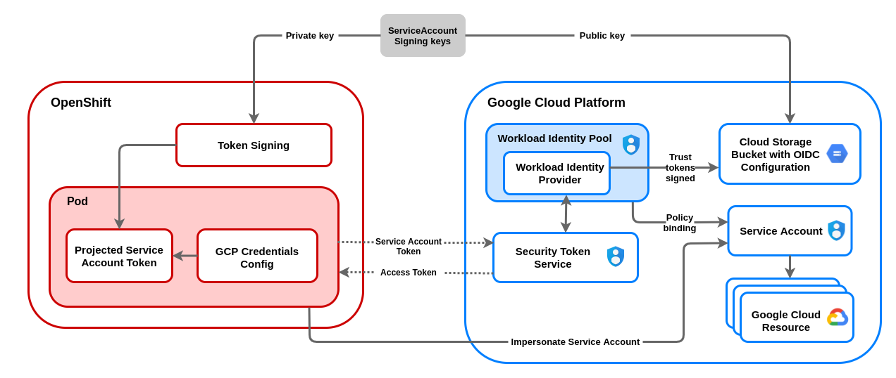

# Short lived credentials with GCP Workload Identity Federation
### Overview
OpenShift can be configured to use temporary credentials for different components with GCP Workload Identity. It enables an authentication flow allowing a component to assume an IAM Service Account resulting in short-lived credentials. It also automates requesting and refreshing of credentials using an OIDC identity provider. OpenShift can sign ServiceAccount tokens trusted by the provider which can be projected into a Pod and used for authentication. The following is a diagram showing how it works.



We start by creating an RSA key pair. The private key is provided to the OpenShift cluster via the installer. The kube-apiserver uses this key to sign service account tokens. These tokens are projected into pods and rotated by kubelet every 1 hour. The public key is stored along with openid-configuration in the google cloud storage bucket, which serves as the identity provider. We also create a workload identity pool along with a provider that has an issuer url (the public url of the storage bucket). Every in-cluster OpenShift component has the gcp credentials configuration file encoded in the kube secret. This configuration file has a path to an oidc token, details about the workload identity provider that can authenticate this token, and also the GCP service account that needs to be impersonated (a sample json of this config file is provided in the next section for reference). The google client shares the OIDC token with the GCP security token service (STS), which validates if the OIDC token is from a trusted provider before issuing an access token. We also set up an IAM policy that allows identities in the workload identity pool to impersonate the service account. With these policies in place, OpenShift components can use the signed access token to authenticate with the GCP service account.

### Changes in the Credentials Secret with Workload Identity
If we check the credentials secret, we have the following base64 encoded content in the `service_account.json` key of the `data` field.

Without Workload Identity, the type of the credentials is `service_account`. These credentials include a private RSA key, in the `private_key` field, to be able to authenticate to gcp. This private key needs to be kept secure and is not rotated.

```json
{
   "type": "service_account",
   "project_id": "test-project",
   "private_key_id": "216fbde61a93dabd942ad738062f0ff0811b69f8",
   "private_key": "<private_key>",
   "client_email": "test-openshift-i-42ssv@test-project.iam.gserviceaccount.com",
   "client_id": "100684158900346633229",
   "auth_uri": "https://accounts.google.com/o/oauth2/auth",
   "token_uri": "https://oauth2.googleapis.com/token",
   "auth_provider_x509_cert_url": "https://www.googleapis.com/oauth2/v1/certs",
   "client_x509_cert_url": "https://www.googleapis.com/robot/v1/metadata/x509/test-service-account-42ssv@test-project.iam.gserviceaccount.com"
}
```

With Workload Identity, the type of the credentials is `external_account`. `audience` is the target audience which is the workload identity provider. The `service_account_impersonation_url` key contains the resource url of the service account that can be impersonated with these credentials. `credentials_source.file` is the path to the oidc token, which is exchanged for a google access token. The oidc token is rotated every one hour and thus credentials are short lived.

```json
{
   "type": "external_account",
   "audience": "//iam.googleapis.com/projects/123456789/locations/global/workloadIdentityPools/test-pool/providers/test-provider",
   "subject_token_type": "urn:ietf:params:oauth:token-type:jwt",
   "token_url": "https://sts.googleapis.com/v1/token",
   "service_account_impersonation_url": "https://iamcredentials.googleapis.com/v1/projects/-/serviceAccounts/test-service-account-42ssv@test-project.iam.gserviceaccount.com:generateAccessToken",
   "credential_source": {
      "file": "/path/to/oidc/token",
      "format": {
         "type": "text"
      }
   }
}
```

### Steps to install an OpenShift Cluster with Workload Identity

1. Set the variable `$RELEASE_IMAGE`

   `$RELEASE_IMAGE` should be a recent and supported  OpenShift release image that you want to deploy in your cluster.
   Please refer to the [support matrix](../README.md#support-matrix) for compatibilities.

   A sample release image would be `RELEASE_IMAGE=quay.io/openshift-release-dev/ocp-release:${RHOCP_version}-${Arch}`

   Where `RHOCP_version` is the OpenShift version (e.g `4.10.0-fc.4` or `4.9.3`) and the `Arch` is the architecture type (e.g `x86_64`)

2. Extract the GCP Credentials Request objects from the above release image. You must use version 4.7 or newer of the `oc` CLI.
   ```
   mkdir credreqs ; oc adm release extract --cloud=gcp --credentials-requests $RELEASE_IMAGE --to=./credreqs
   ```
3. Extract the `openshift-install` and `ccoctl` binaries from the release image.
   ```
   oc adm release extract --command=openshift-install $RELEASE_IMAGE
   CCO_IMAGE=$(oc adm release info --image-for='cloud-credential-operator' ${RELEASE_IMAGE}) && oc image extract ${CCO_IMAGE} --file='/usr/bin/ccoctl' --registry-config=${PULL_SECRET_PATH:-.}/pull-secret
   ```
4. Create an install-config.yaml
   ```
   ./openshift-install create install-config
   ```
5. Make sure that we install the cluster in Manual mode
   ```
   echo "credentialsMode: Manual" >> install-config.yaml
   ``` 
6. Create install manifests
   ```
   ./openshift-install create manifests   
   ```
7. Create GCP resources using the [ccoctl](./ccoctl.md) tool (you will need GCP credentials with sufficient permissions). The following command will generate public/private ServiceAccount signing keys, create the cloud storage bucket, upload the OIDC config into the bucket, set up a workload identity pool/provider, and create an IAM service account for each GCP Credentials Request. It will also dump the files needed by the installer in the `output_dir` directory
   ```
   ccoctl gcp create-all --name=<gcp_infra_name> --region=<gcp_region> --project=<gcp-project-id> --credentials-requests-dir=/path/to/credreqs/directory/created/in/step/2 --output-dir=<output_dir>
   ```
8. Copy the manifests created in the step 7 and put them in the same location as install-config.yaml in the `manifests` directory
   ```
   cp _output/manifests/* /path/to/dir/with/install-config.yaml/manifests/
   ```
9. Copy the private key for the ServiceAccount signer and put it in the same location as install-config.yaml
   ```
   cp -a _output/tls /path/to/dir/with/install-config.yaml
   ```
10. Run the OpenShift installer
    ```
    ./openshift-install create cluster --log-level=debug
    ```

### Post install verification

1. Connect to the newly installed cluster and verify that the OpenShift cluster does not have `root` credentials. Below command should throw secret not found error
   ```yaml
   oc get secrets -n kube-system gcp-credentials
   ```
2. Verify that components are assuming the IAM Service Account specified in the secret manifests, instead of creds minted by the cloud-credential-operator. The following command should show you the `type` as `external_account` and `service_account_impersonation_url` should contain the email of the service account used by the image registry operator.
   ```yaml
   oc get secrets -n openshift-image-registry installer-cloud-credentials -o json | jq -r '.data."service_account.json"' | base64 -d
   ```
   sample output of the above command
   ```json
   {
      "type": "external_account",
      "audience": "//iam.googleapis.com/projects/123456789/locations/global/workloadIdentityPools/test-pool/providers/test-provider",
      "subject_token_type": "urn:ietf:params:oauth:token-type:jwt",
      "token_url": "https://sts.googleapis.com/v1/token",
      "service_account_impersonation_url": "https://iamcredentials.googleapis.com/v1/projects/-/serviceAccounts/test-openshift-image-registry-42ssv@test-project.iam.gserviceaccount.com:generateAccessToken",
      "credential_source": {
         "file": "/var/run/secrets/openshift/serviceaccount/token",
         "format": {
            "type": "text"
         }
      }
   }
   ```

### Cleanup GCP resources after uninstalling the cluster

Make sure you clean up the following resources after you uninstall your cluster. You can use the `gcp_infra_name` used in installation step 7 to identify these resources.

1. Workload Identity Pool and Provider
2. Cloud storage bucket used to store OpenID Connect configuration and the public key
3. IAM service accounts created by ccoctl tool along with project policy bindings

You can use `ccoctl gcp delete --name=<name> --project=<gcp-project-id>` to delete all the above resources.
