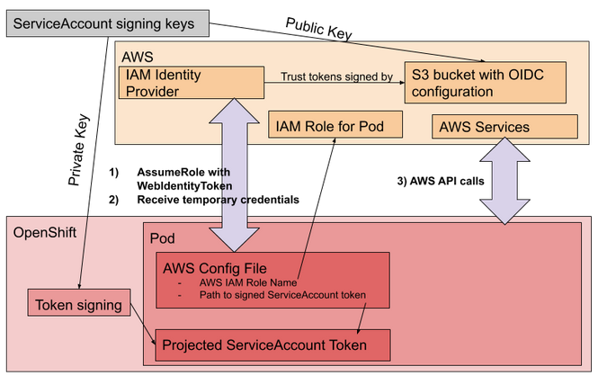
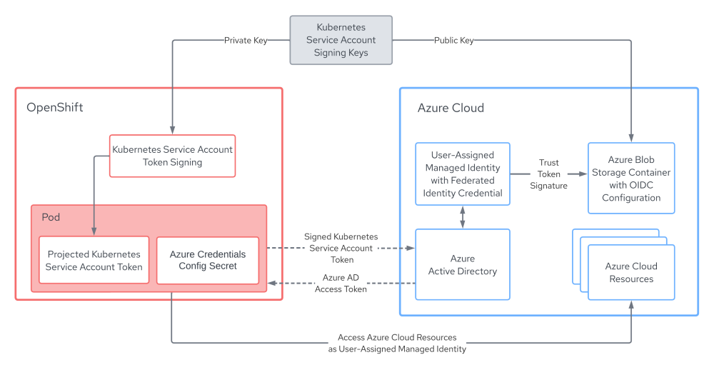
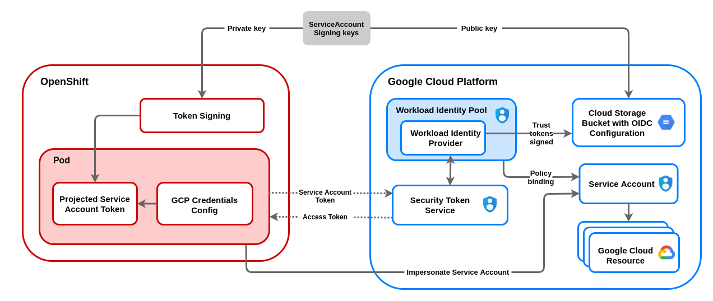

# Short-term credentials
### Overview
OpenShift can be configured to use short-term credentials for components with [AWS Security Token Service](https://docs.aws.amazon.com/STS/latest/APIReference/welcome.html), [Azure AD Workload Identity](https://azure.github.io/azure-workload-identity/docs/), or [GCP Workload Identity Federation](https://docs.cloud.google.com/iam/docs/workload-identity-federation). In this configuration, the cloud provider is configured to trust the Kubernetes ServiceAccount tokens signed by the OpenShift cluster for the purpose of authenticating to specific roles or service accounts. A component such as a cluster operator can utilize the signed ServiceAccount token mounted in the Pod to gain access to the cloud provider via the role or service account that was specifically configured for the component. This enables fine-grained control of permissions for each component. This process also automates requesting and refreshing of credentials. The ServiceAccount token used by a Pod is rotated by the kubelet on the node where Pod is running when the Pod's ServiceAccount token is approaching expiry. ServiceAccount tokens are valid for one hour.

The following diagrams illustrate how it works.

AWS Security Token Service



Azure AD Workload Identity



GCP Workload Identity Federation



In order to take advantage of short-term credentials, an OpenShift cluster must be configured with an RSA key pair with which to sign ServiceAccount tokens. We begin by creating this RSA key pair. The private key is provided to the OpenShift cluster via the OpenShift installer. The public key is stored in an storage bucket or container along with OpenID configuration which serves as the identity provider.

Azure User-Assigned Managed Identities are configured with the Issuer URL (public URL of the Azure Blob Container) containing the public key and OpenID configuration to allow for federation of the identity to the OIDC identity provider. Every in-cluster component receives a Kubernetes Secret containing the details of a User-Assigned Managed Identity created on the component's behalf. The Azure Identity SDK used within those components requests an Azure AD access token for the identity specified by the configuration secret and provides the signed ServiceAccount token to Azure AD. Azure AD validates that the ServiceAccount token is from a trusted identity provider before issuing an access token for the User-Assigned Managed Identity.

GCP Workload Identity pools are configured with the Issuer URL (the public url of the storage bucket). Every in-cluster OpenShift component has the gcp credentials configuration file encoded in the kube secret. This configuration file has a path to an oidc token, details about the workload identity provider that can authenticate this token, and also the GCP service account that needs to be impersonated (a sample json of this config file is provided in the next section for reference). The Google client shares the OIDC token with the GCP security token service (STS), which validates if the OIDC token is from a trusted provider before issuing an access token. We also set up an IAM policy that allows identities in the workload identity pool to impersonate the service account. With these policies in place, OpenShift components can use the signed access token to authenticate with the GCP service account.

### Changes in the Credentials Secret with short-term tokens

* AWS
   
    Previously, if we checked the credentials secret, we'd find the following base64 encoded content in the `credentials` key of the `data` field.

    ```yaml
    [default]
    aws_access_key_id = <access_key_id>
    secret_access_key = <secret_access_key>
    ```

    With STS we have a full-fledged AWS configuration that defines a `role` and `web identity token`

    ```yaml
    [default]
    sts_regional_endpoints = regional
    role_name = arn:...:role/some-role-name
    web_identity_token_file = /path/to/token
    ```
    The token is a projected ServiceAccount into the Pod, and is short-lived for an hour after which it is refreshed.

* Azure

    Without Azure AD Workload Identity, an Azure credentials secret includes an `azure_client_secret` which is essentially a password used to authenticate with Azure AD for the identity identified by `azure_client_id`. This `azure_client_secret` needs to be kept secure and is not rotated automatically.

    ```yaml
    apiVersion: v1
    data:
      azure_client_id: <client id>
      azure_client_secret: <client secret>
      azure_region: <region>
      azure_resource_prefix: <resource group prefix eg. "mycluster-az-t68n4">
      azure_resourcegroup: <resource group eg. "mycluster-az-t68n4-rg">
      azure_subscription_id: <subscription id>
      azure_tenant_id: <tenant id>
    kind: Secret
    type: Opaque
    ```

    With Azure AD Workload Identity, an Azure credentials secret contains the `azure_client_id` of the User-Assigned Managed Identity that the component will be authenticating as along with the path to the mounted ServiceAccount token, `azure_federated_token_file`. The ServiceAccount token mounted at this path is refreshed hourly and thus the credentials are short-lived.

    ```yaml
    apiVersion: v1
    data:
      azure_client_id: <client id>
      azure_federated_token_file: </path/to/mounted/service/account/token>
      azure_region: <region>
      azure_subscription_id: <subscription id>
      azure_tenant_id: <tenant id>
    kind: Secret
    type: Opaque
    ```


* GCP

    If we check the credentials secret, we have the following base64 encoded content in the `service_account.json` key of the `data` field.

    Without Workload Identity, the type of the credentials is `service_account`. These credentials include a private RSA key, in the `private_key` field, to be able to authenticate to gcp. This private key needs to be kept secure and is not rotated.

    ```json
    {
       "type": "service_account",
       "project_id": "test-project",
       "private_key_id": "<private_key_id>",
       "private_key": "<private_key>",
       "client_email": "test-openshift-i-42ssv@test-project.iam.gserviceaccount.com",
       "client_id": "<client_id>",
       "auth_uri": "https://accounts.google.com/o/oauth2/auth",
       "token_uri": "https://oauth2.googleapis.com/token",
       "auth_provider_x509_cert_url": "https://www.googleapis.com/oauth2/v1/certs",
       "client_x509_cert_url": "https://www.googleapis.com/robot/v1/metadata/x509/test-service-account-42ssv@test-project.iam.gserviceaccount.com"
    }
    ```

    With Workload Identity, the type of the credentials is `external_account`. `audience` is the target audience which is the workload identity provider. The `service_account_impersonation_url` key contains the resource url of the service account that can be impersonated with these credentials. `credentials_source.file` is the path to the oidc token, which is exchanged for a Google access token. The oidc token is rotated every one hour and thus credentials are short-lived.

    ```json
    {
       "type": "external_account",
       "audience": "//iam.googleapis.com/projects/123456789/locations/global/workloadIdentityPools/test-pool/providers/test-provider",
       "subject_token_type": "urn:ietf:params:oauth:token-type:jwt",
       "token_url": "https://sts.googleapis.com/v1/token",
       "service_account_impersonation_url": "https://iamcredentials.googleapis.com/v1/projects/-/serviceAccounts/test-service-account-42ssv@test-project.iam.gserviceaccount.com:generateAccessToken",
       "credential_source": {
          "file": "/path/to/oidc/token",
          "format": {
             "type": "text"
          }
       }
    }
    ```

### Steps to install an OpenShift Cluster with manual mode short-term credentials
1. Obtain a recent version of the OpenShift CLI `oc`.
    
    Reference the [OpenShift CLI installation steps in the OpenShift documentation](https://docs.redhat.com/en/documentation/openshift_container_platform/latest/html/cli_tools/openshift-cli-oc#cli-getting-started).

1. Set the `$RELEASE_IMAGE` environment variable.

    `$RELEASE_IMAGE` should be a recent and supported  OpenShift release image that you want to deploy in your cluster.
    Please refer to the [support matrix](../README.md#support-matrix) for compatibilities.

    A sample release image would be `RELEASE_IMAGE=quay.io/openshift-release-dev/ocp-release:${RHOCP_version}-${Arch}`
    
    Where `RHOCP_version` is the OpenShift version (e.g `4.10.0-fc.4` or `4.9.3`) and the `Arch` is the architecture type (e.g `x86_64`)

1. Extract the `openshift-install` and `ccoctl` binaries from the release image. You can specify the version of rhel for the ccoctl binaries (i.e., `--command=ccoctl.rhel9`).
    ```bash
    oc adm release extract --command=openshift-install $RELEASE_IMAGE
    oc adm release extract --command=ccoctl $RELEASE_IMAGE
    ```

1. Create an install-config.yaml
    ```bash
    ./openshift-install create install-config
    ```

1. Make sure that we install the cluster in Manual mode by setting the `credentialsMode` within `install-config.yaml`.

    We can accomplish this using [yq](https://github.com/mikefarah/yq) or by editing `install-config.yaml` directly.

    ```bash
    yq -i '.credentialsMode = "Manual"' install-config.yaml
    ```

1. Extract CredentialsRequests objects from the release image.

    ```bash
    oc adm release extract --credentials-requests --included --install-config=install-config.yaml $RELEASE_IMAGE --to=./credreqs
    ```

1. Create install manifests

    ```bash
    ./openshift-install create manifests
    ```

1. Create the cloud provider resources using [ccoctl](ccoctl.md#steps-create).

    * AWS

        You will need aws credentials with sufficient permissions. The following command will:
        * Generate public/private ServiceAccount signing keys and place them into the tls directory.
        * Create the S3 bucket (with public read-only access). You can alternatively use a private S3 bucket with a CloudFront Distribution providing access to the OIDC config by including the --create-private-s3-bucket parameter. More information on the technical details [here](./sts-private-bucket.md)
        * Upload the OIDC config into the bucket.
        * Set up an IAM Identity Provider that trusts that bucket configuration.
        * Create IAM Roles for each AWS CredentialsRequest extracted above.
        * Generate a secret manifests for each CredentialsRequest and place it into the manifests directory.

        ```bash
        ./ccoctl aws create-all \
          --name <aws_infra_name> \
          --region <aws_region> \
          --credentials-requests-dir credreqs
        ```

    * Azure

        You will need Azure credentials with sufficient permissions. The Azure credentials can be automatically detected after having logged into the [Azure CLI](https://learn.microsoft.com/en-us/cli/azure/install-azure-cli) `az login` or may be provided as environment variables (`AZURE_CLIENT_ID`, `AZURE_CLIENT_SECRET`, `AZURE_TENANT_ID`). Be sure to choose the same region as specified when creating the install-config. The following command will:
        * Generate public/private ServiceAccount signing keys and place them into the tls directory.
        * Create an empty Azure ResourceGroup in which to install the cluster. It is used to scope created identities and must be configured as the cluster installation ResourceGroup within the `install-config.yaml` (See below). The name will default to `<azure_infra_name>` unless specified with via the `--installation-resource-group-name` parameter.
        * Create an Azure ResourceGroup in which to create identity resources.
        * Create an Azure StorageAccount, Azure Blob Container and upload OIDC configuration to the Blob Container.
        * Create User-Assigned Managed Identities for each Azure CredentialsRequest.
        * Generate a secret manifests for each CredentialsRequest and place it into the manifests directory.

        ```bash
        ./ccoctl azure create-all \
          --name <azure_infra_name> \
          --region <azure_region> \
          --subscription-id <azure_subscription_id> \
          --tenant-id <azure_tenant_id> \
          --dnszone-resource-group-name <azure_dns_zone_resourcegroup_name> \
          --credentials-requests-dir credreqs
        ```

        Modify the `install-config.yaml` to specify the ResourceGroup to install the cluster into as configured above.
        ```bash
        yq -i '.platform.azure.resourceGroupName = "<azure_infra_name>"' install-config.yaml
        ```

    * GCP

        You will need GCP credentials with sufficient permissions. The following command will:
        * Generate public/private ServiceAccount signing keys and place them into the tls directory.
        * Create the cloud storage bucket and upload the OIDC config into the bucket.
        * Set up a workload identity pool and provider.
        * Create an IAM service account for each GCP Credentials Request.
        * Generate a secret manifests for each CredentialsRequest and place it into the manifests directory.

        ```bash
        ./ccoctl gcp create-all \
          --name <gcp_infra_name> \
          --region <gcp_region> \
          --project <gcp-project-id> \
          --credentials-requests-dir credreqs
        ```

1. Run the OpenShift installer
    ```
    ./openshift-install create cluster
    ```

### Steps to in-place migrate an OpenShift Cluster to short-term tokens

1. Extract CredentialsRequests from the cluster's release image.

    ```bash
    oc adm release extract --credentials-requests --included --to credreqs --registry-config ~/.pull-secret
    ```

1. Extract the cluster's current ServiceAccount public signing key.

    ```bash
    oc get secret/next-bound-service-account-signing-key \
      --namespace openshift-kube-apiserver-operator \
      -o jsonpath='{ .data.service-account\.pub }' \
    | base64 -d \
    > serviceaccount-signer.public
    ```

1. Create the cloud provider resources using [ccoctl](ccoctl.md#steps-create).

    * AWS
        ```bash
        ./ccoctl aws create-all \
          --name <aws_infra_name> \
          --region <aws_region> \
          --credentials-requests-dir credreqs
        ```

    * Azure
        ```bash
        ./ccoctl azure create-all \
          --name <azure_infra_name> \
          --region <azure_region> \
          --subscription-id <azure_subscription_id> \
          --tenant-id <azure_tenant_id> \
          --dnszone-resource-group-name <azure_dns_zone_resourcegroup_name> \
          --credentials-requests-dir credreqs
        ```

    * GCP
        ```bash
        ./ccoctl gcp create-all \
          --name <gcp_infra_name> \
          --region <gcp_region> \
          --project <gcp-project-id> \
          --credentials-requests-dir credreqs
        ```

1. Extract the OIDC issuer URL from the generated manifests in the output directory and patch the cluster `authentication` config, setting `spec.serviceAccountIssuer`.
    ```bash
    OIDC_ISSUER_URL=`awk '/serviceAccountIssuer/ { print $2 }' ./manifests/cluster-authentication-02-config.yaml`

    oc patch authentication cluster --type=merge -p "{\"spec\":{\"serviceAccountIssuer\":\"${OIDC_ISSUER_URL}\"}}"
    ```

1. Wait for the kube-apiserver pods to be updated with the new config. This process can take several minutes.

    ```bash
    oc adm wait-for-stable-cluster
    ```

1. Restart all nodes to refresh the service accounts on all pods. This *will* take a while.

    ```bash
    oc adm reboot-machine-config-pool mcp/worker mcp/master
    oc adm wait-for-node-reboot nodes --all
    ```

1. Set the credentialsMode to Manual.

    ```bash
    oc patch cloudcredential cluster --patch '{"spec":{"credentialsMode":"Manual"}}' --type=merge
    ```

1. Apply Secrets generated by the ccoctl tool above

    ```bash
    $ find ./manifests -iname "*yaml" -print0 | xargs -I {} -0 -t oc replace -f {}
    ```

* Azure

    Also apply the azure pod identity webhook configuration. You may need replace it if the configuration already exists.

    ```bash
    oc apply -f ./manifests/azure-ad-pod-identity-webhook-config.yaml
    ```

1. Restart all nodes. This ensures the pods configured for short-term token authentication are restarted and using the new configuration.

   ```bash
   oc adm reboot-machine-config-pool mcp/worker mcp/master
   oc adm wait-for-node-reboot nodes --all
   oc adm wait-for-stable-cluster
   ```

1. At this point the cluster is using short-term tokens. The "root" credentials Secret should be removed as it is not longer needed for mint or passthrough mode.

* AWS
   ```bash
   oc delete secret -n kube-system aws-creds
   ```

* Azure
   ```bash
   oc delete secret -n kube-system azure-credentials
   ```

* GCP
   ```bash
   oc delete secret -n kube-system gcp-credentials
   ```

### Post install/migrate verification

1. Connect to the cluster and verify that the OpenShift cluster does not have `root` credentials. The specified command should return a secret not found error.

    * AWS
        ```bash
        oc get secrets -n kube-system aws-creds
        ```

    * Azure
        ```bash
        oc get secrets -n kube-system azure-credentials
        ```

    * GCP
        ```bash
        oc get secrets -n kube-system gcp-credentials
        ```


1. Verify the operator secrets are configured to use short-term token authentication.

    * AWS

        Verify that components are assuming the IAM Role specified in the secret manifests, instead of creds minted by the cloud-credential-operator. The following command should show you the `role` and `web identity token` used by the image registry operator

        ```bash
        oc get secrets -n openshift-image-registry installer-cloud-credentials -o json | jq -r .data.credentials | base64 -d
        ```

        Sample output of the above command

        ```ini
        [default]
        role_arn = arn:aws:iam::123456789:role/<aws_infra_name>-openshift-image-registry-installer-cloud-credentials
        web_identity_token_file = /var/run/secrets/openshift/serviceaccount/token
        ```

    * Azure
    
        Verify that components are assuming the `azure_client_id` specified in the secret manifests, instead of credentials passed through by the Cloud Credential Operator. The secret displayed should not contain an `azure_client_secret` key and will instead contain an `azure_federated_token_file` key.

        ```bash
        oc get secrets -n openshift-image-registry installer-cloud-credentials -o yaml
        ```

        Sample output of the above command:

        ```json
        {
          "azure_client_id": "cG90YXRvIHNhbGFkIGJyZWFkIGJvd2wK",
          "azure_federated_token_file": "L2RyeS9ydWIvY2hpY2tlbi93aW5ncy8K",
          "azure_region": "Y29ybiBicmVhZAo=",
          "azure_subscription_id": "Y2hvcml6byB0YWNvcwo=",
          "azure_tenant_id": "bW9sYXNzZXMgY29va2llcwo="
        }
        ```

    * GCP

        Verify that components are assuming the IAM Service Account specified in the secret manifests, instead of creds minted by the cloud-credential-operator. The following command should show you the `type` as `external_account` and `service_account_impersonation_url` should contain the email of the service account used by the image registry operator.

        ```bash
        oc get secrets -n openshift-image-registry installer-cloud-credentials -o json | jq -r '.data."service_account.json"' | base64 -d
        ```

       Sample output of the above command
       ```json
       {
          "type": "external_account",
          "audience": "//iam.googleapis.com/projects/123456789/locations/global/workloadIdentityPools/test-pool/providers/test-provider",
          "subject_token_type": "urn:ietf:params:oauth:token-type:jwt",
          "token_url": "https://sts.googleapis.com/v1/token",
          "service_account_impersonation_url": "https://iamcredentials.googleapis.com/v1/projects/-/serviceAccounts/test-openshift-image-registry-42ssv@test-project.iam.gserviceaccount.com:generateAccessToken",
          "credential_source": {
             "file": "/var/run/secrets/openshift/serviceaccount/token",
             "format": {
                "type": "text"
             }
          }
       }
       ```

### Cleanup cloud resources when uninstalling the cluster
Delete the cloud resources using the [ccoctl](ccoctl.md#deleting-resources) tool. This can be done either before or after the cluster is destroyed using the openshift-install binary.

* AWS
    ```bash
    ./ccoctl aws delete \
      --name <aws_infra_name> \
      --region <aws_region>
    ```

* Azure
    ```bash
    ./ccoctl azure delete \
      --name <azure_infra_name> \
      --region <azure_region> \
      --subscription-id <azure_subscription_id> \
      --delete-oidc-resource-group
    ```

* GCP
    ```bash
    ./ccoctl gcp delete \
      --name <name>
      --project <gcp-project-id>
      --credentials-requests-dir credreqs
    ```
    Note: gcp relies on the objects in the credreqs directory created at installation. In cases where this is no longer available, you can attempt extract them again using `oc extract` as described in the installation workflow. Otherwise, the ccoctl binary may miss cleaning up some cloud resources. If `oc` is authenticated to the cluster you are deleting and it running and accessible, you can omit the `--install-config` parameter to include the credentialRequests used by the cluster.