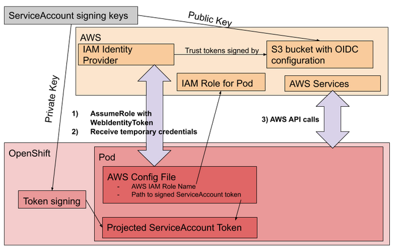

# Short lived Credentials with AWS Security Token Service
### Overview
OpenShift can be configured to use temporary credentials for different components with AWS Security Token Service (STS). It enables an authentication flow allowing a component to assume an IAM Role resulting in short-lived credentials. It also automates requesting and refreshing of credentials using an AWS IAM OpenID Connect (OIDC) Identity Provider. OpenShift can sign ServiceAccount tokens trusted by AWS IAM which can be projected into a Pod and used for authentication. The following is a diagram showing how it works.



### Changes in the Credentials Secret with STS
Previously, if we checked the credentials secret, we'd find the following base64 encoded content in the `credentials` key of the `data` field.

```yaml
[default]
aws_access_key_id = <access_key_id>
secret_access_key = <secret_access_key>
```

With STS we have a full-fledged AWS configuration that defines a `role` and `web identity token`

```yaml
[default]
sts_regional_endpoints = regional
role_name = arn:...:role/some-role-name
web_identity_token_file = /path/to/token
```
The token is a projected ServiceAccount into the Pod, and is short lived for an hour after which it is refreshed.

### Steps to install an OpenShift Cluster with STS

1. Set the variable `$RELEASE_IMAGE`

   `$RELEASE_IMAGE` should be a recent and supported  OpenShift release image that you want to deploy in your cluster.
   Please refer to the [support matrix](../README.md#support-matrix) for compatibilities.

   A sample release image would be `RELEASE_IMAGE=quay.io/openshift-release-dev/ocp-release:${RHOCP_version}-${Arch}`

   Where `RHOCP_version` is the OpenShift version (e.g `4.10.0-fc.4` or `4.9.3`) and the `Arch` is the architecture type (e.g `x86_64`)

2. Extract the AWS Credentials Request objects from the above release image

   With newer version of oc CLI (4.7+):
   ```
   mkdir credreqs ; oc adm release extract --cloud=aws --credentials-requests $RELEASE_IMAGE --to=./credreqs
   ```
3. Extract the `openshift-install` and `ccoctl` binaries from the release image.
   ```
   oc adm release extract --command=openshift-install $RELEASE_IMAGE
   CCO_IMAGE=$(oc adm release info --image-for='cloud-credential-operator' ${RELEASE_IMAGE}) && oc image extract ${CCO_IMAGE} --file='/usr/bin/ccoctl' --registry-config=${PULL_SECRET_PATH:-.}/pull-secret
   ```
4. Create an install-config.yaml
   ```
   ./openshift-install create install-config
   ```
5. Make sure that we install the cluster in Manual mode
   ```
   echo "credentialsMode: Manual" >> install-config.yaml
   ```
6. Create install manifests
   ```
   ./openshift-install create manifests
   ```
7. There are two options to expose the public endpoint used by the IAM OIDC identity provider on AWS: A) public S3 Bucket (default); B) AWS CloudFront Distribution serving thumbprints stored on private S3 Bucket:

A. Create AWS resources using the [ccoctl](ccoctl.md#steps-create) tool (you will need aws credentials with sufficient permissions). The command below will generate public/private ServiceAccount signing keys, create the S3 bucket (with public read-only access), upload the OIDC config into the bucket, set up an IAM Identity Provider that trusts that bucket configuration, and create IAM Roles for each AWS CredentialsRequest extracted above. It will also dump the files needed by the installer in the `_output` directory
   ```
   ./ccoctl aws create-all \
     --name <aws_infra_name> \
     --region <aws_region> \
     --credentials-requests-dir ./credreqs \
     --output-dir _output/
   ```

B. To create a CloudFront Distribution with a private S3 bucket to store OIDC config, run the following command. More information on the technical details [here](./sts-private-bucket.md)
   ```
   ./ccoctl aws create-all \
     --name <aws_infra_name> \
     --region <aws_region> \
     --credentials-requests-dir ./credreqs \
     --output-dir _output/
     --create-private-s3-bucket
   ```

8. Copy the manifests created in the step 7 and put them in the same location as install-config.yaml in the `manifests` directory
   ```
   cp _output/manifests/* /path/to/dir/with/install-config.yaml/manifests/
   ```
9. Copy the private key for the ServiceAccount signer and put it in the same location as install-config.yaml
   ```
   cp -a _output/tls ./path/to/dir/with/install-config.yaml/
   ```
10. Run the OpenShift installer
    ```
    ./openshift-install create cluster --log-level=debug
    ```

### Post install verification

1. Connect to the newly installed cluster and verify that the OpenShift cluster does not have `root` credentials. The following command should throw a secret not found error:
   ```yaml
   oc get secrets -n kube-system aws-creds
   ```
2. Verify that components are assuming the IAM Role specified in the secret manifests, instead of creds minted by the cloud-credential-operator. The following command should show you the `role` and `web identity token` used by the image registry operator
   ```yaml
   oc get secrets -n openshift-image-registry installer-cloud-credentials -o json | jq -r .data.credentials | base64 -d
   ```
   sample output of the above command
   ```
   [default]
   role_arn = arn:aws:iam::123456789:role/<aws_infra_name>-openshift-image-registry-installer-cloud-credentials
   web_identity_token_file = /var/run/secrets/openshift/serviceaccount/token
   ```

### Cleanup AWS resources after uninstalling the cluster

Delete the S3 bucket, IAM identity provider, and IAM Roles using the  [ccoctl](ccoctl.md#deleting-resources) tool.

### Steps to in-place migrate an OpenShift Cluster to STS

NOTE This is just for developers interested in taking an existing cluster to STS. This is explicitly NOT RECOMMENED OR SUPPORTED.

1. Extract the cluster's ServiceAccount public signing key:

   ```bash
   $ oc get configmap --namespace openshift-kube-apiserver bound-sa-token-signing-certs --output json | jq --raw-output '.data["service-account-001.pub"]' > serviceaccount-signer.public
   ```

2. Create an output directory for `ccoctl` generated manifests and move the public key file to the output directory.
   ```bash
   $ mkdir ./newstscluster ; mv serviceaccount-signer.public ./newstscluster/serviceaccount-signer.public
   ```

3. Create the AWS IAM Identity provider and the S3 bucket with the OIDC config files:
   In `<name-you-choose>` it will be the prefix of the OIDC bucket name and identity provider name that would be created (since under the hood it's an S3 bucket name, it should be globally unique).

   ```bash
   $ ./ccoctl aws create-identity-provider --output-dir newstscluster --name <name-you-choose> --region us-east-2
   ```

4. Save/note the last line from that output which contains the ARN for the IAM Identity provider.

5. Extract the OIDC issuer URL from the generated manifests in the output directory and patch the cluster `authentication` config, setting `spec.serviceAccountIssuer`.
   ```bash
   OIDC_ISSUER_URL=`awk '/serviceAccountIssuer/ { print $2 }' output_dir/manifests/cluster-authentication-02-config.yaml`

   oc patch authentication cluster --type=merge -p "{\"spec\":{\"serviceAccountIssuer\":\"${OIDC_ISSUER_URL}\"}}"
   ```

6.  Wait for the kube-apiserver pods to be updated with the new config. This process can take several minutes.
   ```bash
   oc adm wait-for-stable-cluster
   ```

7. Restart all pods (this *will* take a while) in the cluster (because all ServiceAccounts need to be refreshed after updating the serviceAccountIssuer field):
   ```bash
   oc adm reboot-machine-config-pool mcp/worker mcp/master
   oc adm wait-for-node-reboot nodes --all
   ```

8.  Set the `CloudCredentials`` CR's .spec.credentialsMode to Manual.
   ```bash
   oc patch cloudcredential cluster --patch '{"spec":{"credentialsMode":"Manual"}}' --type=merge
   ```

9. Get the current version of the cluster:
   ```bash
   $ CLUSTER_VERSION=$(oc get clusterversion version -o json | jq -r '.status.desired.version')
   ```

10. Get the release image for that version:
   ```bash
   $ CLUSTER_IMAGE=$(oc get clusterversion version -o json | jq -r ".status.history[] | select(.version == \"${CLUSTER_VERSION}\") | .image")
   ```

11. Extract CredentialsRequests resources from that release image:
   ```bash
   $ oc adm release extract --credentials-requests --cloud=aws --from ${CLUSTER_IMAGE} --to cred-reqs
   ```

12. Create IAM Roles for each of the CredentialsRequests from the release image:
   ```bash
   $ ./ccoctl aws create-iam-roles --output-dir ./newstscluster/ --name newstscluster --identity-provider-arn ARN_CREATED_FROM_CREATE_IDENTITY_PROVIDER_COMMAND --region us-east-2 --credentials-requests-dir ./cred-reqs/
   ```

13. Apply the Secrets generated by the above command:
   ```bash
   $ find ./newstscluster/manifests -iname "*yaml" -print0 | xargs -I {} -0 -t oc replace -f {}
   ```

14.  Restart all the pods, as they may have additional functionality when they detect they are workload identity enabled.

   ```bash
   oc adm reboot-machine-config-pool mcp/worker mcp/master
   oc adm wait-for-node-reboot nodes --all
   oc adm wait-for-stable-cluster
   ```

15. At this point the cluster is using STS. The previously created IAM Users/credentials can be deleted as they are not being used. The "root" AWS creds Secret can also be removed.

   ```bash
   oc delete secret -n kube-system aws-creds
   ```
